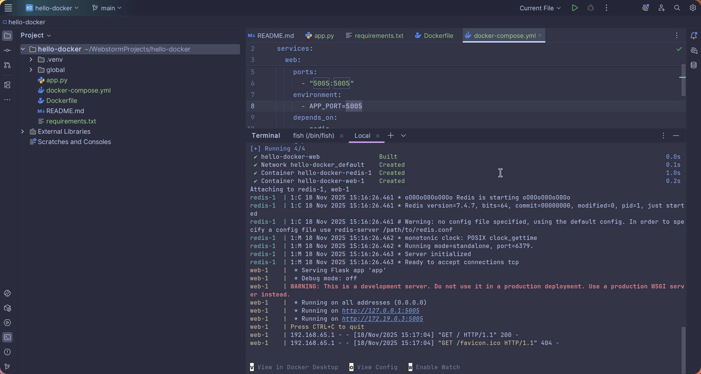
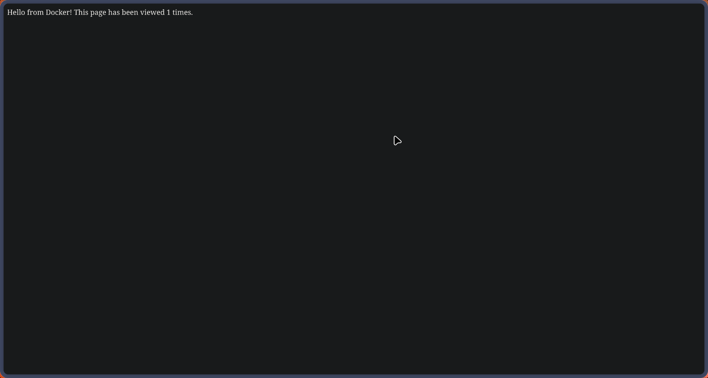

# hello-docker

## Мета
Навчитися працювати з директивами Dockerfile і запускати багатосервісний застосунок (Flask + Redis) за допомогою Docker Compose.

## Інструкція з запуску
1. Запустіть:  
   `docker compose up --build`
2. Перейдіть у браузері на `http://localhost:5000`, щоб побачити лічильник переглядів, який працює через Redis.

## Результати

## Висновки
Під час виконання лабораторної роботи було закріплено створення Dockerfile із правильним базовим образом, налаштовано запуск через Docker Compose, а також перевірено взаємодію Flask API з Redis. Отримані навички дозволяють швидко готувати та деплоїти невеликі мікросервіси.
